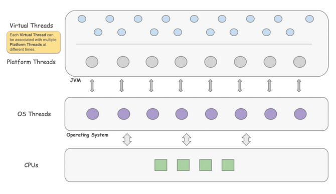

# Virtual Thread

> A new thread model provided by JVM, for creating **_lightweight_** application thread that maps to a platform thread

- The virtual thread can map to different platform thread at different time(Many-to-Many)
- thread stack live in heap(dynamic stack space)

## Mechanism

- yield whenever it encounters IO blocking operation, made runnable again and when one becomes available
    - large amount of jdk lib have rewrite for this refactor
- implementation is based on fork join pool
    - context switch should be lightweight in most cases

## Benefit it brings

- less overhead
    - context switch occurs in application level rather than os level, stack, cache remains in hardware
    - cheap to start/stop
- much lighter weight
    - the tradition platform thread requires around 2MB / thread, If you wanted to support a million thread, you’d need
      2TB of memory!
    - virtual threads only takes up 200-300 bytes / thread
- simplicity
    - write code in sequential way rather than the reactive way
- better scheduling
    - scheduling by os thread is dumb as the os don't know the context of the execution thread
    - on the other hand, developer have better understanding about the code and context, scheduling in application level
      help reduce the overhead
- scalability
    - can easily support millions of virtual thread

## Limitation

### Pinning Issue

> Pinning occurs when virtual thread cannot be unmounted from its carrier, monopolizing that carrier thread from
> executing other tasks

#### Occurs in

- Synchronized Blocks or Methods
- Native Methods or Foreign Functions

### Thread Local

- as thread Local variable has its own independent copy of the variable, isolated from other threads
    - caching expensive object in thread local take up huge amount of space when massive threads are created

## Capable for

- IO intensive application

## Bear in mind

- It is not for computational intensive task
- _**NOT**_ designed **_highly_** responsive aware application(first come, first served)
    - as the total throughput increase, this rule only applies on **_HIGHLY_** responsive aware application
    - as it adds another layer of scheduling
    - much more threads are waiting for schedule, higher chance to have starvation problem
- synchronized block is not support

## Migration

- migration is cheap, usually, one to few lines of code change, eg: changing thread pool to virtual thread factory
    - migrate task to virtual thread, not pool
- most lib and framework have stated their migration to support to virtual thread eg: spring, tomcat
- thread local
    - don't cache expensive object in thread local
        - some mutable thread local object can be replaced by immutable object eg: SimpleDateFormatter ->
          DateTimeFormatter

### stumbling block

- mysql jdbc
    - currently not supported
        - [the migration of virtual thread have actually contributed but not merged](https://bugs.mysql.com/bug.php?id=110512)
    - the mysql jdbc is designed to be thread safe, but the modern application usage of jdbc are thread confined
    - [A lock free implementation of mysql jdbc](https://github.com/neowu/mysql-connector-j)

## Best practise

- as it is lightweight, thread pool is not necessary
- limit virtual thread by semaphores
- thread per task rather than recycling the thread
- dont block long task
    - causing massive virtual tasks to be blocked

## Further Discussion

- combining the virtual thread with reactive model
    - hard to maintain
    - gain even more performance

## Ref

- [JEP 425](https://openjdk.org/jeps/425)
- [Azul virtual thread](https://www.azul.com/blog/jdk-21-delivers-virtual-threads-other-new-features-and-long-term-support/)
- [Modern Scalable Concurrency for the Java Platform By Alan Bateman](https://www.youtube.com/watch?v=XF4XZlPZc_c)
- [How to Diagnose and Mitigate Pinning in Java’s Virtual Thread Execution](https://foojay.io/today/how-to-diagnose-and-mitigate-pinning-in-javas-virtual-thread-execution/)